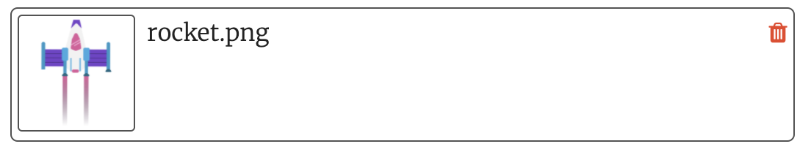

## Decolar!

Cada vez que um novo quadro é desenhado, o foguete precisa se mover para cima na tela para criar um efeito de animação.

{:width="300px"}

--- task ---

O projeto inicial tem uma imagem de foguete fornecida para você.

--- /task ---

--- task ---

Adicione código à função `configuração()` para carregar a imagem do foguete em uma variável global `foguete`.

--- code ---
---
language: python filename: main.py line_numbers: true line_number_start: 20
line_highlights: 24, 26
---

def setup():   
#Setup your animation here   
size(screen_size, screen_size)   
image_mode(CENTER)   
global planet, rocket   
planet = load_image('planet.png')    
rocket = load_image('rocket.png')

--- /code ---

--- /task ---

A posição `y` do foguete começará em 400 (a altura da tela) e diminuirá em 1 cada vez que um novo quadro for desenhado.

--- task ---

Adicione uma variável global `foguete_y` para acompanhar a posição `y` do foguete.

--- code ---
---
language: python filename: main.py line_numbers: true line_number_start: 7
line_highlights: 9
---

# Configurar variáveis globais
screen_size = 400    
rocket_y = screen_size #Start at the bottom

--- /code ---

--- /task ---

--- task ---

Defina uma função `desenhar_foguete()` para alterar a posição `y` do foguete e redesenhá-lo.

`foguete_y -= 1` é uma forma mais curta de dizer `foguete_y = foguete_y - 1`.

--- code ---
---
language: python filename: main.py line_numbers: true line_number_start: 11
line_highlights: 12-16
---

# A função desenhar_foguete vai aqui
def draw_rocket():

  global rocket_y #Use the global rocket_y variable    
rocket_y -= 1 #Move the rocket    
image(rocket, width/2, rocket_y, 64, 64)

--- /code ---

--- /task ---

--- task ---

Chame seu novo `desenhar_foguete()` na função `desenhar()` para que o foguete seja redesenhado a cada quadro.

--- code ---
---
language: python filename: main.py line_numbers: true line_number_start: 34
line_highlights: 37
---

def draw():   
#Things to do in every frame   
draw_background()   
draw_rocket()

--- /code ---

--- /task ---

--- task ---

**Teste:** Execute seu código para verificar que o foguete começa na parte inferior da tela e se move para cima a cada quadro.

--- /task ---

--- save ---
