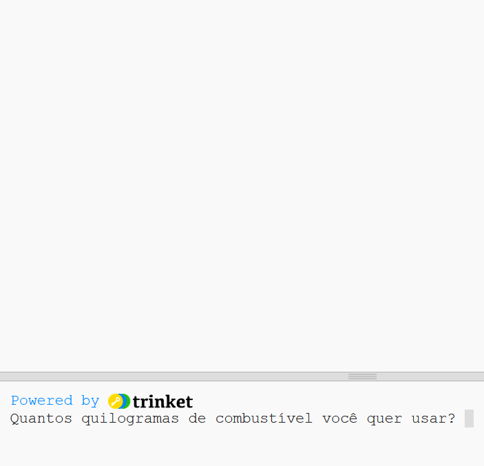
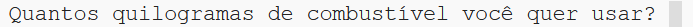
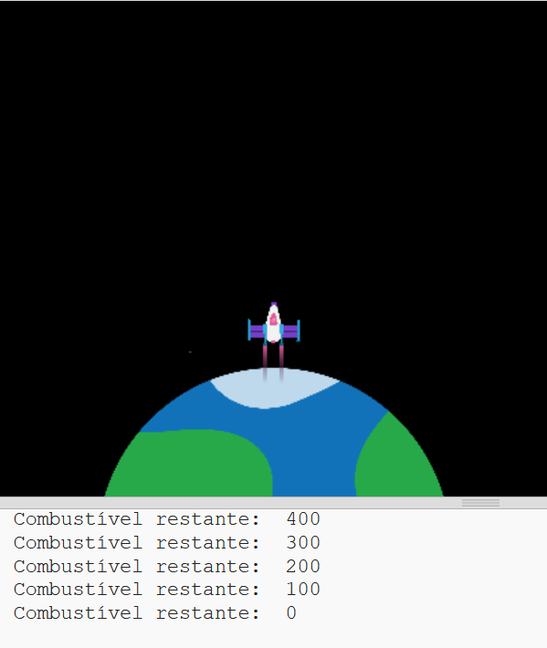

## Queimar combustível

Uma das coisas mais importantes a decidir ao lançar um foguete é quanto combustível carregar nele. 

Para fazer isso, você precisa simular quanto combustível será queimado na viagem.

{:width="300px"}

--- task ---

Adicione uma variável para acompanhar a quantidade de combustível que seu foguete queima (em quadros).

--- code ---
---
language: python filename: main.py line_numbers: true line_number_start: 7
line_highlights: 10
---

# Configurar variáveis globais
screen_size = 400   
rocket_y = screen_size  
burn = 100 #How much fuel is burned in each frame

--- /code ---

--- /task ---

--- task ---

Na parte inferior do seu programa, adicione código para perguntar ao usuário quanto combustível adicionar ao foguete e guarde sua resposta em uma variável global `combustivel`.

--- code ---
---
language: python filename: main.py line_numbers: true line_number_start: 52
line_highlights: 52
---

fuel = int(input('How many kilograms of fuel do you want to use?'))   
run()

--- /code ---

--- /task ---

O foguete só deve se mover se não tiver queimado todo o seu combustível.

--- task ---

Adicione código à função `desenhar_foguete()` para reduzir o restante `combustivel` pela `queima` de cada quadro. Use `imprimir()` para mostrar quanto combustível resta em cada quadro.

Você precisa dizer que deseja usar as variáveis globais `combustivel` e `queima`.

--- code ---
---
language: python filename: main.py — draw_rocket() line_numbers: true line_number_start: 15
line_highlights: 15, 17-18
---

  global rocket_y, fuel, burn   
rocket_y -= 1   
fuel -= burn #Burn fuel   
print('Fuel left: ', fuel)

--- /code ---

--- /task ---

--- task ---

**Teste:** Execute seu programa para verificar que a animação não inicia até `Quantos quilogramas de combustível você quer usar?` for respondido. Tente inserir `30000` como a quantidade de combustível.

O foguete continuará funcionando mesmo que não tenha mais combustível.

--- /task ---

--- task ---

O foguete só deve se mover se tiver combustível suficiente. Adicione uma declaração `if` para verificar se `combustivel >= queima`.

Você precisará indentar todas as linhas de código antes da chamada de função `imagem()`. Para fazer isso, destaque todas as linhas com o mouse e, em seguida, carregue na tecla <kbd>Tab</kbd> no teclado para recuar todas as linhas de uma vez.

A linha `imagem()` não precisa ser recuada porque você sempre quer desenhar o foguete.

--- code ---
---
language: python filename: main.py — draw_rocket() line_numbers: true line_number_start: 15
line_highlights: 16-31
---

  global rocket_y, fuel, burn

  if fuel >= burn: #Still got fuel   
rocket_y -= 1   
fuel -= burn   
print('Fuel left: ', fuel)   

    no_stroke() #Turn off the stroke   
    
    for i in range(25):   
      fill(255, 255 - i*10, 0)   
      ellipse(width/2, rocket_y + i, 8, 3)    
    
    fill(200, 200, 200, 100)   
    for i in range(20):   
      ellipse(width/2 + randint(-5, 5), rocket_y + randint(20, 50), randint(5, 10), randint(5, 10))

  image(rocket, width/2, rocket_y, 64, 64)

--- /code ---

--- /task ---

--- task ---

**Teste:** Execute seu programa para verificar que o foguete pára quando não há mais combustível.

{:width="300px"}

--- /task ---

Esta simulação de computador não é muito precisa, mas é boa o suficiente para nossa animação.

--- save ---

