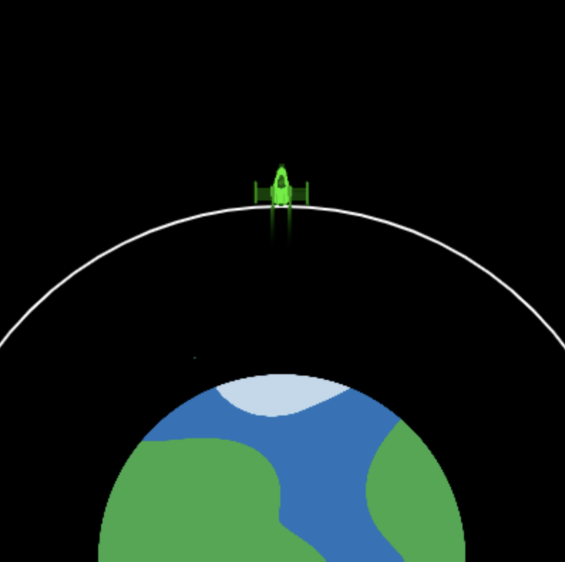

## Alcançando a órbita

O objetivo do lançamento do foguete é colocar um satélite em órbita. 

Uma órbita é um caminho curvo que um objeto percorre em torno de outro devido à gravidade.

O foguete pode mudar de cor para mostrar o sucesso do lançamento. 

{:width="400px"}

### Desenhe uma linha de órbita

--- task ---

Crie duas novas variáveis globais para definir o raio do círculo da órbita e a coordenada `y` da órbita para o ponto que o centro do foguete precisa alcançar para lançar o satélite.

--- code ---
---
language: python
filename: main.py
line_numbers: true
line_number_start: 7 
line_highlights: 11-12
---

# Configurar variáveis globais
tamanho_tela = 400   
foguete_y = tamanho_tela   
queimar = 100   
raio_orbital = 250   
orbita_y = tamanho_tela - raio_orbital

--- /code ---

--- /task ---

--- task ---

Atualize a função `desenhar_plano_de_fundo()` para desenhar uma elipse para representar a órbita do satélite que o foguete precisa alcançar.

--- code ---
---
language: python
filename: main.py - draw_background()
line_numbers: true
line_number_start: 38
line_highlights: 42-45
---

def desenhar_plano_de_fundo():   
    background(0) # Abreviação de plano de fundo (0, 0, 0) — preto   
    image(planeta, width/2, height, 300, 300)   

    no_fill() # Desligue qualquer preenchimento 
    stroke(255) # Defina um traço branco
    stroke_weight(2)
    ellipse(width/2, height, raio_orbital * 2, raio_orbital * 2)

--- /code ---

--- /task ---

--- task ---

**Teste:** Execute seu programa e verifique que uma linha de órbita branca foi desenhada.

{:width="300px"}

--- /task ---

### Lance o foguete para a órbita

O foguete deve parar quando atingir a órbita do satélite – o fim da missão.

--- task ---

Atualize seu código `if combustivel >= queima` para verificar também se o foguete não atingiu a órbita.

Você pode usar as instruções `and` em `if` para verificar se duas ou mais condições são verdadeiras.

--- code ---
---
language: python
filename: main.py - draw_rocket()
line_numbers: true
line_number_start: 15
line_highlights: 19
---

# A função desenhar_foguete vai aqui
def desenhar_foguete():
    global foguete_y, combustivel, queimar

        if combustivel >= queimar and foguete_y > orbita_y: # Ainda voando

--- /code ---

--- /task ---

--- task ---

**Teste:** Execute seu projeto e digite `50000` para a quantidade de combustível. Isso deve ser bastante combustível para alcançar a órbita. O foguete deve parar de se mover quando atingir a órbita.

--- /task ---

### Verifique se o lançamento foi bem-sucedido

O foguete deve ficar vermelho se ficar sem combustível antes de ficar alto o suficiente para lançar o satélite.

--- task ---

--- code ---
---
language: python
filename: main.py — draw_rocket()
line_numbers: true
line_number_start: 30
line_highlights: 34-35
---

    fill(200, 200, 200, 100)   
    for i in range(20):   
        ellipse(width/2 + randint(-5, 5), foguete_y + randint(20, 50), randint(5, 10), randint(5, 10))

    if combustivel < queimar and foguete_y > orbita_y:  # Não há mais combustível e não em órbita   
        tint(255, 0, 0)  # Fracasso

--- /code ---

--- /task ---

--- task ---

**Teste:** Execute seu código e digite `20000` para a quantidade de combustível. Verifique que o foguete fica vermelho quando para abaixo da órbita.

{:width="300px"}

Oh não, o planeta ficou vermelho!

--- /task ---

--- task ---

A função `tint()` define a cor do tom para todas as imagens que são desenhadas até que você altere o tom ou use `no_tint()` para desativá-lo.

**Escolha:** Adicione uma chamada para `no_tint()` depois de desenhar a imagem para que o planeta não fique vermelho no próximo quadro — ou deixe-o se você gosta do planeta ficando vermelho!

--- code ---
---
language: python
filename: main.py - draw_rocket()
line_numbers: true
line_number_start: 34
line_highlights: 38
---

    if combustivel < queimar and foguete_y > orbita_y:    
        tint(255, 0, 0)  # Fracasso

    image(foguete, width/2, foguete_y, 64, 64)   
    no_tint()  # Assim, o planeta não será tingido de vermelho no próximo quadro!

--- /code ---

--- /task ---

--- task ---

Use a função `tint()` novamente, desta vez para colorir o foguete de verde se o foguete tiver combustível suficiente para alcançar a órbita do satélite:

--- code ---
---
language: python
filename: main.py - draw_rocket()
line_numbers: true
line_number_start: 34
line_highlights: 36-37
---

    if combustivel < queimar and foguete_y > orbita_y:    
        tint(255, 0, 0)  # Fracasso   
    elif foguete_y <= orbita_y:   
        tint(0, 255, 0)  # Sucesso   

    image(foguete, width/2, foguete_y, 64, 64)   
    no_tint()

--- /code ---

--- /task ---

--- task ---

**Teste:** Execute seu projeto e digite `50000` para a quantidade de combustível. Verifique que o seu foguete fica verde quando atinge a órbita do satélite.

{:width="300px"}

--- /task ---

Agora você tem uma simulação que pode ser usada para mostrar quanto combustível é necessário no mínimo para alcançar a órbita do satélite. Isso é ótimo; no entanto, você pode consumir uma enorme quantidade de combustível e ainda ter sucesso, mas isso é caro e um desperdício!

--- task ---

Altere as condições em seu código de sucesso para que o foguete só fique verde se atingir a órbita `e` tiver menos de 1.000 kg de combustível restante.

Adicione um código para colorir o foguete de amarelo se o foguete tiver mais de 1.000 kg de combustível restante quando atingir a órbita.

--- code ---
---
language: python
filename: main.py
line_numbers: true
line_number_start: 34
line_highlights: 36, 38-39
---

    if combustivel < queimar and foguete_y > orbita_y:   
      tint(255, 0, 0) # Fracasso
    elif combustivel < 1000 and foguete_y <= orbita_y:
      tint(0, 255, 0) # Sucesso
    elif combustivel >= 1000 and foguete_y <= orbita_y:
      tint(255, 200, 0) # Excesso de combustível

    image(foguete, width/2, foguete_y, 64, 64)    
    no_tint()  # Assim, o planeta não estará tingido no próximo quadro!

--- /code ---

--- /task ---

--- task ---

**Teste:** Execute seu programa várias vezes com números diferentes; por exemplo, 25.000 kg de combustível deve ser a quantidade necessária para tornar o foguete verde, mas também verifique se a tonalidade amarela também funciona usando um número maior.

{:width="300px"}

--- /task ---

--- save ---
