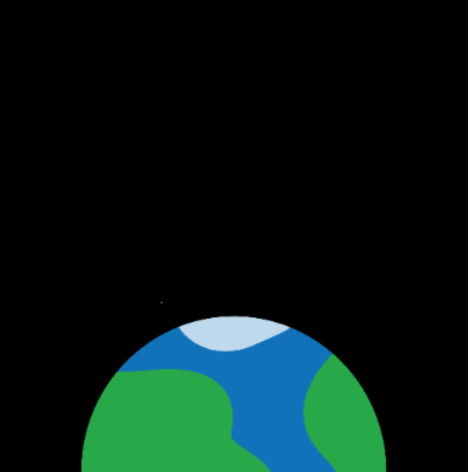

## Намалюй фон

--- task ---

Відкрий [початковий проєкт](https://editor.raspberrypi.org/en/projects/rocket-launch-starter){:target="_blank"}.

--- /task ---

Спочатку ти створиш чорне тло, — це буде космос.

--- task ---

Визнач функцію `draw_background()` і встанови чорний колір для тла.

--- code ---
---
language: python line_numbers: true line_number_start: 12
line_highlights: 13-14
---

# Тут буде функція draw_background
def draw_background():   
background(0, 0, 0)

--- /code ---

--- /task ---

--- task ---

Додай цю функцію до списку дій, які будуть виконуватися у кожному кадрі (у функції `draw()`).

--- code ---
---
language: python line_numbers: true line_number_start: 25
line_highlights: 27
---

def draw(): # Що відбувається на кожному кадрі draw_background()

--- /code ---

--- /task ---

--- task ---

**Протестуй:** запусти код. Ти маєш побачити чорний квадрат.

--- /task ---

--- task ---

Додай рядок коду, який виводитиме зображення планети.

--- code ---
---
language: python line_numbers: true line_number_start: 13
line_highlights: 15-16
---
def draw_background():  
background(0,0,0) image(planet, screen_size/2, screen_size, 300, 300)

--- /code ---

Зображення зручно завантажувати в `setup()`, щоб вони завжди були напоготові, коли тобі потрібно буде їх використати, а твоя анімація буде швидко запускатись.

- image filename - we have already loaded the planet image
- x coordinate - we have already set the screen size
- y coordinate
- image width
- image height

--- /task ---

--- task ---

def setup():   
#Налаштувати анімацію можна тут   
size(screen_size, screen_size)   
image_mode(CENTER)   
global planet   
planet = load_image('planet.png') #Твоя обрана планета

{:width="300px"}

--- /task ---

### A different planet?

--- task ---

Визнач функцію `draw_background()`, щоб намалювати фон, внизу коментаря, який підказує, куди його треба поставити.

If you want to change the planet image, change `planet.png` in the code to the filename of your chosen planet, for example, `orange_planet.png`.

--- code ---
---
language: python line_numbers: true line_number_start: 17
line_highlights: 15-17
---
def setup(): # Set up your animation here size(screen_size, screen_size) image_mode(CENTER) global planet planet = load_image('planet.png')

--- /code ---

--- /task ---

