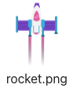

## Зліт!

Кожного разу, коли малюється новий кадр, ракета повинна рухатися вгору, щоб створити ефект анімації.

{:width="300px"}

--- task ---

У стартовому проєкті тобі надається зображення ракети.

--- /task ---

--- task ---

Додай код до функції `setup()`, щоб завантажити зображення ракети в глобальну змінну `rocket`.

--- code ---
---
language: python filename: main.py line_numbers: true line_number_start: 20
line_highlights: 24, 26
---

def setup():   
# Setup your animation here   
size(screen_size, screen_size)   
image_mode(CENTER)   
global planet, rocket   
planet = load_image('planet.png')    
rocket = load_image('rocket.png')

--- /code ---

--- /task ---

### Make the rocket fly

Позиція ракети `y` буде починатися з 400 (висота екрану), а потім буде зменшуватися на 1 щоразу, коли буде малюватися новий кадр.

--- task ---

Додай глобальну змінну `rocket_y`, щоб відстежувати позицію ракети `y`.

--- code ---
---
language: python filename: main.py line_numbers: true line_number_start: 7
line_highlights: 9
---

# Налаштування глобальних змінних
screen_size = 400    
rocket_y = screen_size  # Start at the bottom

--- /code ---

--- /task ---

--- task ---

Визнач функцію `draw_rocket()`, щоб змінювати позицію ракети `y` та перемалювати її.

`rocket_y -= 1` - це коротший спосіб коду `rocket_y = rocket_y - 1`.

--- code ---
---
language: python filename: main.py line_numbers: true line_number_start: 11
line_highlights: 12-16
---

# Функція draw_rocket викликається тут
def draw_rocket():   
global rocket_y  # Use the global rocket_y variable    
rocket_y -= 1  # Move the rocket    
image(rocket, width/2, rocket_y, 64, 64)

--- /code ---

--- /task ---

--- task ---

Call your new `draw_rocket()` in the `draw()` function so that the rocket gets redrawn every frame.

--- code ---
---
language: python filename: main.py line_numbers: true line_number_start: 33
line_highlights: 36
---

def draw():   
# Things to do in every frame   
draw_background()   
draw_rocket()

--- /code ---

--- /task ---

--- task ---

**Test:** Run your code to check that the rocket starts at the bottom of the screen and moves up each frame.

--- /task ---

--- save ---
