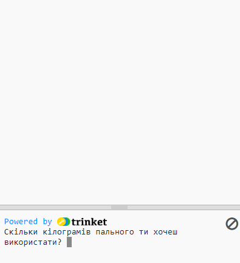
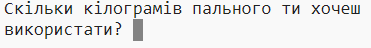
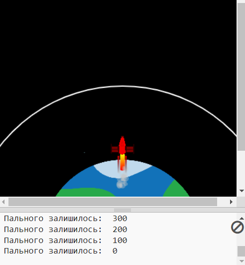

## Спалювання палива

Одне з найважливіших речей, яке необхідно вирішити при запуску ракети, - кількість палива. 

Для цього потрібно визначити, скільки пального буде витрачено протягом подорожі.

{:width="300px"}

--- task ---

Додай змінну, яка буде відстежувати, скільки палива використовує твоя ракета (у кадрах).

--- code ---
---
language: python filename: main.py line_numbers: true line_number_start: 7
line_highlights: 10
---

# Налаштування глобальних змінних
screen_size = 400   
rocket_y = screen_size  
burn = 100 #How much fuel is burned in each frame

--- /code ---

--- /task ---

--- task ---

У нижній частині програми, додай код, який буде запитувати користувача, скільки палива додати в ракету, та збереже його відповідь у глобальну змінну `fuel`.

--- code ---
---
language: python filename: main.py line_numbers: true line_number_start: 52
line_highlights: 52
---

fuel = int(input('How many kilograms of fuel do you want to use?'))   
run()

--- /code ---

--- /task ---

Ракета повинна здійснювати рух тільки в тому випадку, якщо повністю не спалено її паливо.

--- task ---

Додай код до функції `draw_rocket()` для зменшення залишку `fuel` при `burn` на кожному кадрі. Використовуй `print()`, щоб відобразити, скільки пального залишилося, на кожному кадрі.

Потрібно вказати, що ти хочеш використовувати глобальні змінні `fuel` та `burn`.

--- code ---
---
language: python filename: main.py — draw_rocket() line_numbers: true line_number_start: 15
line_highlights: 15, 17-18
---

  global rocket_y, fuel, burn   
rocket_y -= 1   
fuel -= burn #Burn fuel   
print('Fuel left: ', fuel)

--- /code ---

--- /task ---

--- task ---

**Тест:** Запусти свою програму та перевір, чи не запускається анімація до того, як буде отримана відповідь на запитання `Скільки кілограмів пального ти хочеш використати?`. Спробуй ввести кількість палива - `30000`.

Ракета продовжить рух, навіть якщо у неї закінчиться паливо.

--- /task ---

--- task ---

Ракета повинна рухатися тільки якщо у неї залишилося достатньо палива. Додай оператор `if`, щоб перевірити виконання коду `fuel >= burn`.

Тобі потрібно буде зробити відступи для всіх рядків коду перед тим, як буде викликана функція `image()`. Щоб зробити це, виділи за допомогою миші всі рядки та натисни на клавіатурі <kbd>Tab</kbd>, щоб зробити відступ для всіх рядків відразу.

Для рядка `image()` не потрібно робити відступ, тому що тобі потрібно, щоб ракета малювалась завжди.

--- code ---
---
language: python filename: main.py — draw_rocket() line_numbers: true line_number_start: 15
line_highlights: 16-31
---

  global rocket_y, fuel, burn

  if fuel >= burn: #Still got fuel   
rocket_y -= 1   
fuel -= burn   
print('Fuel left: ', fuel)   

    no_stroke() #Turn off the stroke   
    
    for i in range(25):   
      fill(255, 255 - i*10, 0)   
      ellipse(width/2, rocket_y + i, 8, 3)    
    
    fill(200, 200, 200, 100)   
    for i in range(20):   
      ellipse(width/2 + randint(-5, 5), rocket_y + randint(20, 50), randint(5, 10), randint(5, 10))

  image(rocket, width/2, rocket_y, 64, 64)

--- /code ---

--- /task ---

--- task ---

**Тест:** Запусти свою програму та перевір, чи зупиняється ракета, коли закінчується паливо.

{:width="300px"}

--- /task ---

Це комп'ютерне моделювання досить неточне, але цього достатньо для нашої анімації.

--- save ---

