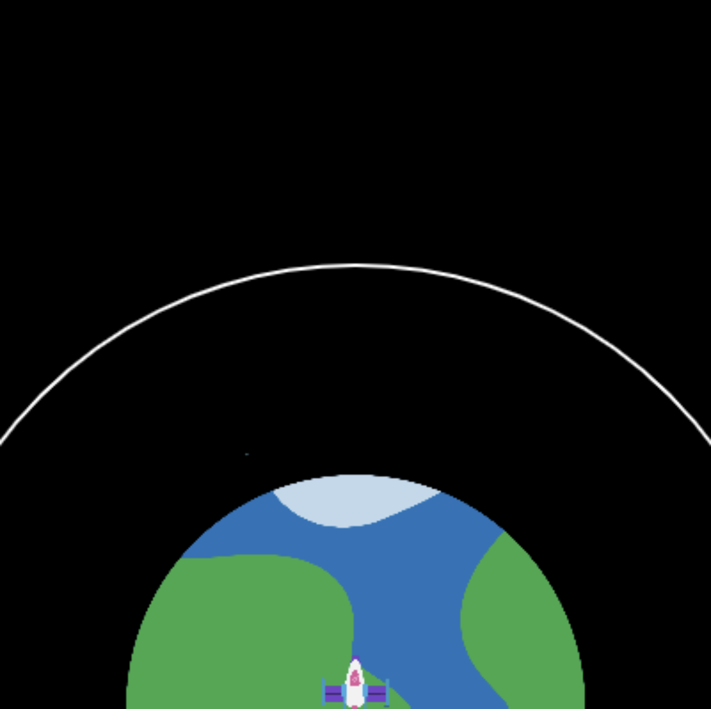

## Вихід на орбіту

Мета запуску ракети - вивести супутник на орбіту. 

Орбіта - це зігнута лінія, по якій рухається один об'єкт навколо іншого під дією сили тяжіння.

Ракета може змінювати колір, щоб показати успішність свого запуску. 

{:width="400px"}

--- task ---

Створи дві нові глобальні змінні, щоб встановити радіус кола орбіти та координату орбіти `y` до точки, якої повинен досягти центр ракети, щоб запустити супутник.

--- code ---
---
language: python filename: main.py line_numbers: true line_number_start: 7
line_highlights: 11-12
---

# Налаштування глобальних змінних
screen_size = 400   
rocket_y = screen_size   
burn = 100   
orbit_radius = 250   
orbit_y = screen_size - orbit_radius

--- /code ---

--- /task ---

--- task ---

Онови функцію `draw_background()`, щоб намалювати овал, який буде відображати орбіту супутника, яку ракета повинна досягти.

--- code ---
---
language: python filename: main.py - draw_background() line_numbers: true line_number_start: 37
line_highlights: 42-45
---

def draw_background():   
background(0) #Short for background(0, 0, 0) — black   
image(planet, width/2, height, 300, 300)

  no_fill() #Turn off any fill  
stroke(255) #Set a white stroke   
stroke_weight(2)   
ellipse(width/2, height, orbit_radius * 2, orbit_radius * 2)

--- /code ---

--- /task ---

--- task ---

**Тест:** Запусти свою програму та перевір, чи намалювалась біла лінія орбіти.

{:width="300px"}

--- /task ---

Ракета повинна зупинитися при досяганні орбіти супутника — це кінець місії.

--- task ---

Онови свій код `if fuel >= burn`, щоб також перевіряти, якщо ракета не буде досягати орбіти.

Ти також можеш скористатися `and` в операторах `if`, щоб перевіряти істинність двох або більше умов.

--- code ---
---
language: python filename: main.py - draw_rocket() line_numbers: true line_number_start: 14
line_highlights: 19
---

# Функція draw_rocket викликається тут
def draw_rocket():

  global rocket_y, fuel, burn

    if fuel >= burn and rocket_y > orbit_y: #Still flying

--- /code ---

--- /task ---

--- task ---

**Тест:** Запусти свій проєкт та введи кількість палива - `50000`. Цього повинно вистачити для досягання орбіти. Ракета повинна зупинитися при досяганні орбіти.

--- /task ---

Ракета повинна пофарбуватися в червоний колір, якщо у неї закінчиться паливо до того, як вона підніметься на достатню висоту для запуску супутника.

--- task ---

--- code ---
---
language: python filename: main.py — draw_rocket() line_numbers: true line_number_start: 30
line_highlights: 34-35
---

    fill(200, 200, 200, 100)   
    for i in range(20):   
      ellipse(width/2 + randint(-5, 5), rocket_y + randint(20, 50), randint(5, 10), randint(5, 10))

  if fuel < burn and rocket_y > orbit_y: #No more fuel and not in orbit tint(255, 0, 0) #Failure

--- /code ---

--- /task ---

--- task ---

**Тест:** Запусти свій проєкт та введи кількість палива - `20000`. Перевір, чи змінила ракета колір на червоний, коли вона зупинилась до орбіти.

{:width="300px"}

О ні, планета теж стала червоною!

--- /task ---

--- task ---

Функція `tint()` встановлює колір для всіх зображень, які створюються, до тих пір, поки ти не зміниш колір або не використаєш код `no_tint()`, щоб вимкнути її.

**Обирай:** Додай виклик коду `no_tint()` після малювання картинки, щоб у наступному кадрі планета не стала червоною. Ти можеш залишити все так, якщо тобі подобається, коли планета стає червоною!

--- code ---
---
language: python filename: main.py - draw_rocket() line_numbers: true line_number_start: 34
line_highlights: 38
---

if fuel < burn and rocket_y > orbit_y: tint(255, 0, 0) #Failure

image(rocket, width/2, rocket_y, 64, 64)   
no_tint() #So the planet isn't tinted red in the next frame!

--- /code ---

--- /task ---

--- task ---

Цього разу, скористайся знову функцією `tint()`, щоб змінити колір ракети на зелений, якщо вона має достатньо палива для досягання орбіти супутника:

--- code ---
---
language: python filename: main.py - draw_rocket() line_numbers: true line_number_start: 34
line_highlights: 36-37
---

if fuel < burn and rocket_y > orbit_y: tint(255, 0, 0) #Failure   
elif rocket_y <= orbit_y:   
tint(0, 255, 0) #Success

image(rocket, width/2, rocket_y, 64, 64)   
no_tint()

--- /code ---

--- /task ---

--- task ---

**Тест:** Запусти свій проєкт та введи кількість палива - `50000`. Перевір, чи змінила ракета колір на зелений при досяганні орбіти супутника.

{:width="300px"}

--- /task ---

Тепер у тебе є моделювання ситуації, яку можна використати, щоб показати мінімальну кількість палива, якого необхідно для досягання орбіти супутника. Це чудово; проте, ти можеш вибрати більшу кількість палива та успішно досягти орбіти, але це буде дорого та неекономно!

--- task ---

Зміни умови у твоєму коді таким чином, щоб ракета стала зеленою, тільки якщо вона досягла орбіти й у неї залишилося менше 1,000 кг палива. Для цього, використовуй `and`.

Додай код, щоб ракета змінювала колір на жовтий, якщо при досяганні орбіти, в неї буде більше 1,000кг палива.

--- code ---
---
language: python filename: main.py line_numbers: true line_number_start: 34
line_highlights: 36, 38-39
---

if fuel < burn and rocket_y > orbit_y: tint(255, 0, 0) #Failure   
elif fuel < 1000 and rocket_y <= orbit_y:   
tint(0, 255, 0) #Success   
elif fuel >= 1000 and rocket_y <= orbit_y:    
tint(255, 200, 0) #Too much fuel

image(rocket, width/2, rocket_y, 64, 64)    
no_tint() #So the planet isn't tinted in the next frame!

--- /code ---

--- /task ---

--- task ---

**Тест:** Запусти свою програму декілька разів, використовуючи різні суми; наприклад, 25,000кг пального повинно вистачити, щоб ракета змінила колір на зелений, але також перевір, чи спрацьовує жовтий колір при використанні більших значень.

{:width="300px"}

--- /task ---

--- save ---
